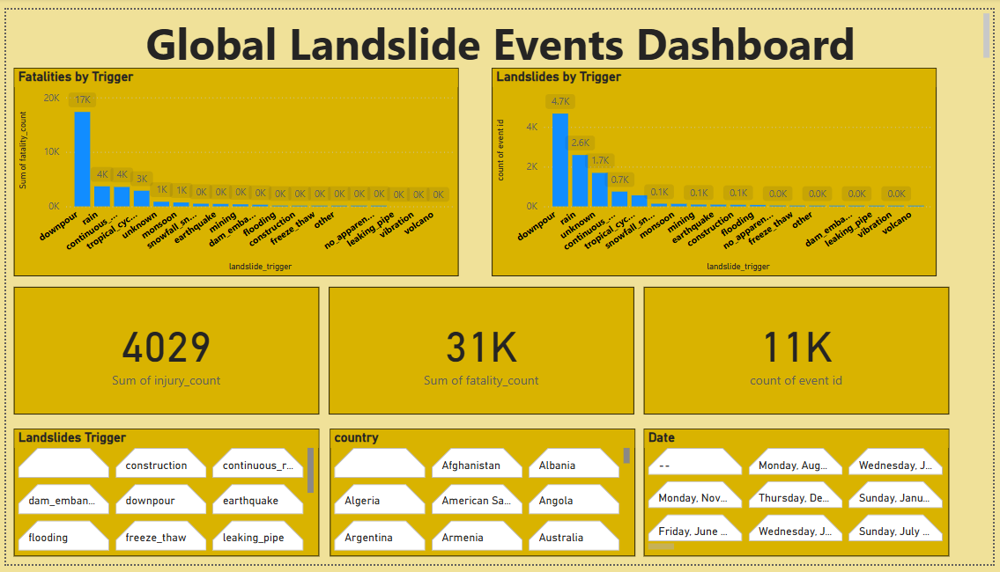

 🌍 Global Landslide Analysis – Capstone Project

This project is a data-driven analysis of global landslide events using data provided by the Global Geological Institute. The objective was to uncover patterns based on geography, environmental triggers, and human impact to support early-warning and preventive systems.

---

## 📊 Tools Used
- **Google Sheets** – Data cleaning and preprocessing
- **Power BI** – Data visualization and dashboard creation
- **GitHub** – Project documentation and version control

---

## 🧼 Cleaned Dataset
The dataset was cleaned using Google Sheets. Key steps included:
- Removing duplicates
- Handling missing values
- Extracting and formatting `event_date` and `event_time`
- Replacing blank fields with standard labels (e.g., `"Unknown"`)

📎 [Click here to view the cleaned dataset]([YOUR_GOOGLE_SHEETS_LINK](https://docs.google.com/spreadsheets/d/1cr0E_HF_WzTAwEW1sq_Dm92-ccyvtxt12s8sZC6vN7E/edit?usp=sharing))

---

## 📈 Dashboard Overview

Key visuals include:
- **Fatalities by trigger**
- **Landslides by trigger**
- **Common landslide causes**
- **Total counts of events, deaths, and injuries**

---

## 📁 Files in This Repository

| File | Description |
|------|-------------|
| `Global_Landslide_Catalog_Export_Row.csv` | Cleaned dataset ready for analysis |
| `Global_Landslide_Catalog_Export_Row.pbix` | Interactive Power BI dashboard |
| `image.png` | Snapshot of the dashboard interface |
| `README.md` | Project documentation (this file) |

---

## ✍️ Author
**Idahosa Erick Obaseki**
Junior Data Analyst – Techware Professional Services 
